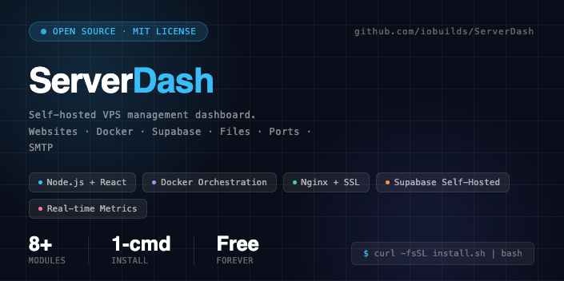
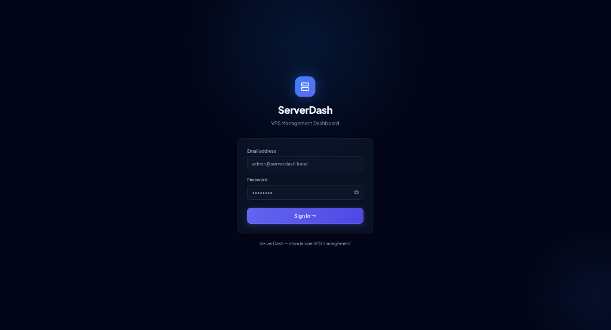
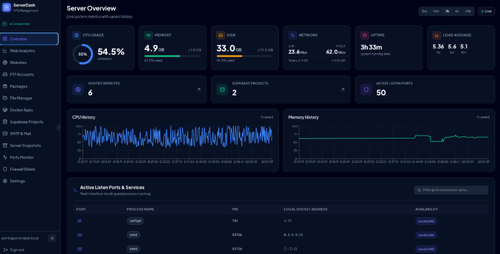

# ServerDash 🚀



<div align="center">


**A high-performance self-hosted VPS management dashboard. Manage websites, Docker containers, firewalls, analytics, backups, files, packages, and database stacks directly from a premium glassmorphic workspace.**

</div>

---

## ✨ Premium Features

| Module | Capabilities |
|--------|-------------|
| **📊 Overview & Telemetry** | Real-time CPU, RAM, disk, and network throughput charts. Polled every 5 seconds, persisted to a 24-hour historical JSON store. |
| **🌐 Websites & Nginx** | Wizard for static, Node.js (PM2-ready), and PHP (Laravel/WordPress) deployments. Configures Nginx templates, virtual directory jails, and secures endpoints using automatic Certbot Let's Encrypt SSL. |
| **🛡️ Firewall (UFW)** | Interactive UFW management dashboard. Add, delete, and view numbered firewall rules and comments. Toggle firewall status safely with port-22 recovery locks. |
| **📈 Web Analytics Suite** | Real-time Nginx log parsing and TCP socket tracking. Render active visitors, unique IPs, referrers, browser distributions, and local **GeoIP2 Geolocation flags** on interactive charts. |
| **📦 Snapshots & Self-Healing Backups** | High-speed, optimized backups using size-excluding `rsync`. Includes disk space usage meters, automated snapshot cleanups, and a 5-minute fault-tolerant restore queue with automatic MySQL and PM2 auto-revival. |
| **🐳 Docker Apps** | Container grid showing real-time CPU/RAM limits, image/compose deployments, interactive lifecycle controls (start/stop/restart/delete stack), and live server-sent event (SSE) log streams. |
| **⚡ Software Runtimes Center** | Displays current local runtimes (Node.js, Docker, Nginx, MariaDB) alongside upstream updates, with direct full-stream APT update/upgrade terminal controls. |
| **📂 File Manager** | Browse the filesystem with safe path bounds. Multi-file uploads/downloads, directory creation, recursive folder deletions, and Monaco code editing. |
| **📧 SMTP & Postfix Mail** | Test mail deliveries, inspect virtual mailbox allocations, view virtual postfix maillogs, and configure global Postfix relays. |

---

## 🏗️ Architecture

```
                 ┌─────────────────────┐
                 │   Browser (React)   │
                 │   Vite + Tailwind   │
                 │  Auth: Local JWT    │
                 └──────────┬──────────┘
                            │ HTTPS + JWT (Port 4001)
                 ┌──────────▼──────────┐
                 │  Express Backend    │
                 │  Node.js (Direct)   │
                 │  Dockerode + UFW    │
                 └──────────┬──────────┘
                            │ Direct Local Shell Exec
                 ┌──────────▼──────────┐
                 │  Your Local VPS     │
                 │  (Ubuntu / Debian)  │
                 └─────────────────────┘
```

---

## 🖥️ Visual Interface Preview

ServerDash features a stunning, state-of-the-art glassmorphic dark-mode user interface designed to maximize accessibility and administrative clarity:

### 🛡️ Dashboard Gateway & Authentication
A secure, timing-safe cryptographically protected login gateway guarding all administrative API interfaces.


### 📊 Real-Time Server Observability Overview
A clean, premium workspace rendering CPU, Memory, Disk, and Network telemetry alongside process tracking and dynamic metrics.


---

## ⚡ Quick Start & Deployment

### 🚀 The One-Command Automated Installer (Highly Recommended)
If you are setting up ServerDash on a **freshly formatted VPS** (running Ubuntu 20.04/22.04/24.04 or Debian 11/12), you can run our production-ready, fully automated one-line installer. 

This script automatically provisions all OS libraries, configures reverse-proxy Nginx servers, sets up Node/PM2 runtimes, configures firewalls, generates secure credentials, and outputs a beautiful login credentials summary dashboard!

To begin, simply execute the following command:

```bash
curl -fsSL https://raw.githubusercontent.com/IO-Builds-Internal/ServerDash/main/install.sh | bash
```

---

### 🛠️ Manual Configuration & Development

If you prefer to configure and run the services manually, follow these standard steps:

#### 1. Clone & Configure
```bash
git clone https://github.com/IO-Builds-Internal/ServerDash.git
cd ServerDash
```

#### 2. Install Dependencies
```bash
# Install backend dependencies
cd backend && npm install

# Install frontend dependencies
cd ../frontend && npm install
```

#### 3. Start Local Development
```bash
# Terminal 1 — Launch Backend Service
cd backend && npm run dev

# Terminal 2 — Launch Frontend Interface
cd frontend && npm run dev
```

***

## 🔧 Environment Variables

### Frontend (`frontend/.env`)

| Variable | Required | Description |
|----------|----------|-------------|
| `VITE_API_URL` | ✅ | Backend API URL (e.g. `http://<vps-ip>:4001`) |

### Backend (`backend/.env`)

| Variable | Required | Description |
|----------|----------|-------------|
| `ADMIN_EMAIL` | ✅ | Panel Admin Email (default: `admin@serverdash.local`) |
| `ADMIN_PASSWORD` | ✅ | Panel Admin Password (default: `ServerDash2026!`) |
| `LOCAL_JWT_SECRET` | ✅ | Secret key for signing dashboard session JWTs |
| `LOCAL_JWT_EXPIRES` | ❌ | Token expiration time (default: `8h`) |
| `PORT` | ❌ | Backend port (default: `4001`) |
| `ALLOWED_ORIGIN` | ❌ | Frontend domain URL allowed for CORS |

***

## 📁 Project Structure

```
ServerDash/
├── frontend/                   # React 19 + Vite 8 + Tailwind v4
│   ├── src/
│   │   ├── pages/              # Clean dashboards & views
│   │   │   ├── LoginPage.jsx
│   │   │   ├── OverviewPage.jsx
│   │   │   ├── WebsitesPage.jsx
│   │   │   ├── FilesPage.jsx
│   │   │   ├── DockerPage.jsx
│   │   │   ├── PackagesPage.jsx
│   │   │   ├── SupabasePage.jsx
│   │   │   ├── FirewallShieldPage.jsx  # Host firewall rules
│   │   │   ├── SnapshotsPage.jsx       # Dynamic server backup engine
│   │   │   ├── AnalyticsPage.jsx       # real-time GeoIP analytics
│   │   │   └── SettingsPage.jsx
│   │   ├── components/
│   │   │   ├── Sidebar.jsx     # Nav controls
│   │   │   └── ProtectedRoute.jsx
│   │   ├── contexts/
│   │   │   └── AuthContext.jsx # Local JWT auth client
│   │   ├── lib/
│   │   │   └── api.js          # Axios client with JWT headers
│   │   └── index.css           # Premium Tailwind variables
│
├── backend/                    # Node.js + Express 5 API
│   ├── src/
│   │   ├── routes/
│   │   │   ├── metrics.js      # Proc telemetry & hist store
│   │   │   ├── sites.js        # Nginx config wizards & certbot
│   │   │   ├── docker.js       # Container streams & stack management
│   │   │   ├── packages.js     # APT packages & upgrades
│   │   │   ├── files.js        # File system operations
│   │   │   ├── firewall.js     # UFW rules controller
│   │   │   ├── analytics.js    # Nginx Weblogs parser & TCP sockets
│   │   │   ├── snapshots.js    # Optimized backup rsync queue
│   │   │   └── supabase.js     # Supabase stack installer
│   │   ├── authMiddleware.js   # JWT token validator
│   │   └── logger.js           # Winston logger
│   └── server.js               # Express app entry
```

---

## 🔒 Security Posture

* **Session Tokens**: All API routes require cryptographically secure HS256 JWT tokens.
* **Timing-Safe Login**: Uses Buffer-level `crypto.timingSafeEqual` comparisons during login authentication to prevent side-channel leaks.
* **Rate Limiting**: Integrated `express-rate-limit` allowing `120` req/min for general API calls and a tight `10` req/min limit on console shell execution.
* **Safe Terminal Streaming**: Packages & command console execution streams use a restricted danger-pattern regex blocker to mitigate malicious host shell scripts.

---

## 🤝 Contributing

1. Fork the repository
2. Create a feature branch: `git checkout -b feature/my-feature`
3. Commit changes: `git commit -S -m 'Add my feature'` (Remember to sign your commits!)
4. Push and open a Pull Request

---

## 📄 License

MIT License — see [LICENSE](LICENSE) for details.
